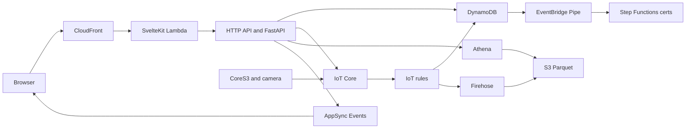

# HomeHub

A serverless smart-home hub: a SvelteKit console, a FastAPI on Lambda, Cognito, DynamoDB, and AWS IoT Core. Matter devices join through a CoreS3 Thread gateway. A Timer Camera F can publish snapshots.

## Architecture



The diagram source is [`docs/homehub-current-state-architecture.drawio`](docs/homehub-current-state-architecture.drawio).

Stages are `int`, `prod`, and a personal `sst dev` stage. Custom domains come from `APP_URL` and `APP_DOMAIN`. Without them, CloudFront uses its default hostname and SES is skipped.

## Stack

- Web: SvelteKit, TypeScript, Tailwind, Cognito
- API: FastAPI on Lambda, Python 3.13
- Data: DynamoDB for devices and recent readings; Athena over S3 Parquet for history
- IoT: IoT Core things, X.509 certificates, MQTT
- Infra: SST v4 modules in `infra/`
- Tests: pytest for the API, Vitest for shared TypeScript

## Prerequisites

- Node 24 (see `.nvmrc`), pnpm 10, Python 3.13, [uv](https://docs.astral.sh/uv/)
- An AWS account and the AWS CLI
- Optional: ESP-IDF and the Arduino CLI for firmware

## Quickstart

```bash
nvm use
pnpm install
uv sync --all-packages
cp .env.example .env.local
pnpm dev
```

`pnpm dev` deploys a personal stage named after your OS user. It does not change shared `int` or `prod`.

`pnpm dev:local` runs only the web app against an already deployed backend.

Copy `.env.example` and set `APP_URL` when you want a custom hostname. AWS SSO profiles, optional cross-account DNS, and stage resource names are in [CONTRIBUTING.md](CONTRIBUTING.md).

## What the API does

| Task | API |
|------|-----|
| Add a device | `POST /devices` |
| List devices | `GET /devices` |
| Get one device | `GET /devices/{deviceId}` |
| Update a device | `PATCH /devices/{deviceId}` |
| Delete a device | `DELETE /devices/{deviceId}` |
| Recent readings | `GET /devices/{deviceId}/readings` |
| Older readings | `GET /devices/{deviceId}/readings/history` |
| Camera snapshot | `GET /devices/{deviceId}/snapshot` |
| Health check | `GET /health` |
| Ready check | `GET /ready` |

The web app sends a Cognito token. Other clients can send `X-Api-Key` when `RestApiKey` is set with `sst secret set`. `GET /devices` accepts `limit` (default 50, max 100) and `cursor`. Open `/api-docs` on the web origin for Swagger.

## Repository layout

```text
apps/web/                  SvelteKit console
services/api/              FastAPI Lambdas
services/auth-triggers/    Cognito post-confirmation Lambda
packages/core/             Shared TypeScript domain
packages/catalog/          JSON catalog shared by TypeScript and Python
firmware/cores3-gateway/   CoreS3 Matter / Thread overlay
firmware/timer-camera/     Timer Camera F sketch
infra/                     SST modules
scripts/deploy/            Stage deploy and reset
scripts/firmware/          USB and OTA flash helpers
scripts/provisioning/      IoT thing and certificate setup
```

## Firmware

- CoreS3 gateway: [firmware/cores3-gateway/README.md](firmware/cores3-gateway/README.md)
- Timer Camera F: [docs/timer-camera-f-setup.md](docs/timer-camera-f-setup.md)

## Tests and deploy

```bash
pnpm verify
pnpm sso
pnpm deploy:int
```

Device certificates live in SSM under `/homehub/devices/{deviceId}/` and are revoked when a device is deleted.

## License

[MIT](LICENSE)
